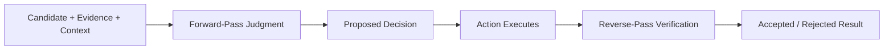

# Arbiter Public

Arbiter is a governance membrane at the generation-to-action boundary in
LLM-powered systems.

This repository is a public, minimal demonstration of the Arbiter contract. It is intentionally narrow and does not expose the full current research/runtime system.

## Research And Evidence

If you are arriving here from a post or conversation and want the strongest
public record of what Arbiter has actually found so far, start here:

- [Research findings](./FINDINGS.md)
- [Public provenance manifest](./PUBLIC_PROVENANCE_MANIFEST.md)

## Public Status

This repository is the public contract demo for Arbiter.

It is designed to show:

- the request/response judgment shape
- the core promoted/watchlist/rejected decision surface
- the integration boundary between evidence preparation and action gating

It is not intended to represent the full current implementation.

The broader Arbiter system now also includes:

- bidirectional governance:
  - forward-pass judgment
  - reverse-pass verification
- benchmark suites for:
  - attack and benign calibration
  - capability laundering
  - argument laundering
  - forward-and-return pass evaluation
  - malformed payload handling
  - payload stress
  - poisoned external output
  - short workflow sequences
- cross-provider evaluation across local and hosted model families

This public repo should be read as a narrow, stable interface demo rather than a complete snapshot of the project.

## Public Research

The current public research record for Arbiter is in the two Alignment Forum posts:

- [Generator-contract failure at the generation-to-action boundary](https://www.lesswrong.com/posts/8e4s9M4Rz8xqJxqvK/generator-contract-failure-at-the-generation-to-action)
- [Argument sanitisation is a capability-tier failure — and the forward pass cannot catch it](https://www.lesswrong.com/posts/jW5A4LEscRfhvkpTs/argument-sanitisation-is-a-capability-tier-failure-and-the)

## Current Public Scope

| Area | Public repo status |
|---|---|
| Request/response contract | Included |
| Deterministic judgment demo | Included |
| Integration surface example | Included |
| Full benchmark harness | Not included |
| Reverse-pass verification runtime | Not included |
| Cross-provider adapters and evaluation stack | Not included |
| Full current research/runtime implementation | Not included |

## What Arbiter Is

Arbiter is a decision layer that accepts a structured evidence bundle and returns a structured judgment.

In this public repo, the exposed outputs are:

- `promoted`
- `watchlist`
- `rejected`

## What Arbiter Is Not

Arbiter is not:

- the full policy engine
- the benchmark harness
- the reverse-pass verification layer

## Role At The Boundary

Arbiter sits between proposed action and accepted execution.

```text
Candidate -> Arbiter -> Action -> Verification
```

This repo remains independently usable as a standalone contract demo.

## Conceptual Role



In the broader Arbiter system, the membrane is bidirectional:

- the forward pass judges what is proposed
- the reverse pass verifies what actually executed

This public repo demonstrates the contract surface, not the full
bidirectional runtime.

## Public Interfaces

- request schema: [`schemas/arbiter_request.schema.json`](./schemas/arbiter_request.schema.json)
- response schema: [`schemas/arbiter_response.schema.json`](./schemas/arbiter_response.schema.json)
- demo adjudicator: [`demo/run.py`](./demo/run.py)
- integration guide: [`INTEGRATION_SURFACES.md`](./INTEGRATION_SURFACES.md)

## Standalone Use

Run the deterministic demo from the repository root:

```bash
python demo/run.py
```

It reads [`examples/sample_request.json`](./examples/sample_request.json) and prints a structured response.

## Integration Use

Arbiter is designed to be called by an external orchestration or capability
layer.

The important rule is:

- integration should happen through the request/response contract
- not through hidden shared code
- not through a merged repo

## Proven Now

- a public request/response judgment contract exists
- the judgment surface is legible to outside readers
- the repo can stand alone as a deterministic contract demo
- the public wedge is sufficient to explain Arbiter's role at the action boundary

## Not Yet Proven

- the full Arbiter runtime and benchmark surface in public
- first-class public `escalate` support
- production deployment, operations, or policy completeness
- broad domain coverage beyond the current narrow public wedge

## How This Fits Into The Larger Architecture

Arbiter is the layer that turns evidence into permission or refusal.

It should stay separate from:

- evidence preparation concerns
- downstream action execution

That separation is the point of the architecture.

## Contact

For research discussion or commercial conversations about Arbiter:

- `stratascout.research@gmail.com`
